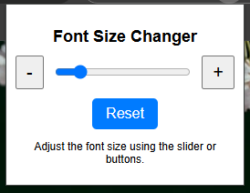

# Font Size Changer Chrome Extension

A simple Chrome extension to dynamically change the font size of any webpage using a slider, plus/minus buttons, and a reset button. Perfect for accessibility or personal preference!

## Features

- **Slider Control**: Drag the slider to adjust font size between 10px and 50px.
- **Plus/Minus Buttons**: Fine-tune font size with precise 1px adjustments.
- **Reset Button**: Instantly reset the font size to the default (16px).

## How to Use

1. **Install the Extension**:
   - Clone or download this repository.
   - Open Chrome and go to `chrome://extensions`.
   - Enable **Developer mode** (top-right corner).
   - Click **Load unpacked** and select the folder containing the extension.

2. **Use the Extension**:
   - Click on the extension icon in the toolbar.
   - Adjust font size with the slider or buttons.
   - Use the reset button to revert to the default size.

## File Structure

```
FontSizeChanger/
├── manifest.json       # Chrome extension configuration
├── popup.html          # HTML for the extension popup
├── popup.js            # JavaScript logic for font size adjustments
├── style.css           # Styling for the popup UI
└── icon.png            # Icon for the extension
```

## Attribution

- **Font Icons**: [Font icons created by Freepik - Flaticon](https://www.flaticon.com/free-icons/font)

## Screenshots



## Contributing

Feel free to fork this repository and contribute! Suggestions and pull requests are welcome.

## License

This project is licensed under the [MIT License](LICENSE).
